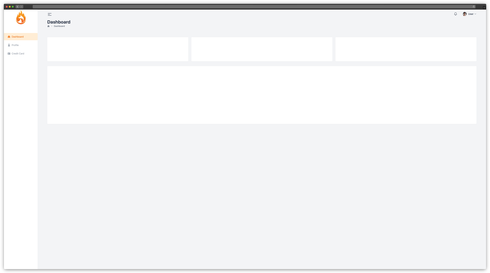

## 🛠 Skills

![react][react] ![next][next] ![tailwind][tailwind] ![comintlint][commitlint] ![prettier][prettier]

## 📄 Roadmap

This project is a way to increase my **Tailwind CSS** skills and, of course, increase the **Next.js** skills to.

For this I follow the video below, but with some personal changes.

[![youtube][youtube]](https://www.youtube.com/watch?v=ypRJ9ScLmco)

### What is missing?

-   [ ] **ESLint** configuration;
-   [ ] Add **Docker** files to run this project with **Docker** in `dev` and `production` mode.

## 🔗 More About Me

[react]: https://img.shields.io/badge/react-1E4174?style=for-the-badge&logo=react&logoColor=white
[next]: https://img.shields.io/badge/Next.js-1E4174?style=for-the-badge&logo=next.js&logoColor=white
[tailwind]: https://img.shields.io/badge/tailwindcss-1E4174?style=for-the-badge&logo=tailwindcss&logoColor=white
[commitlint]: https://img.shields.io/badge/commitlint-1E4174?style=for-the-badge&logo=commitlint&logoColor=white
[prettier]: https://img.shields.io/badge/prettier-1E4174?style=for-the-badge&logo=prettier&logoColor=white
[youtube]: https://img.shields.io/badge/youtube-red?style=for-the-badge&logo=youtube&logoColor=white
